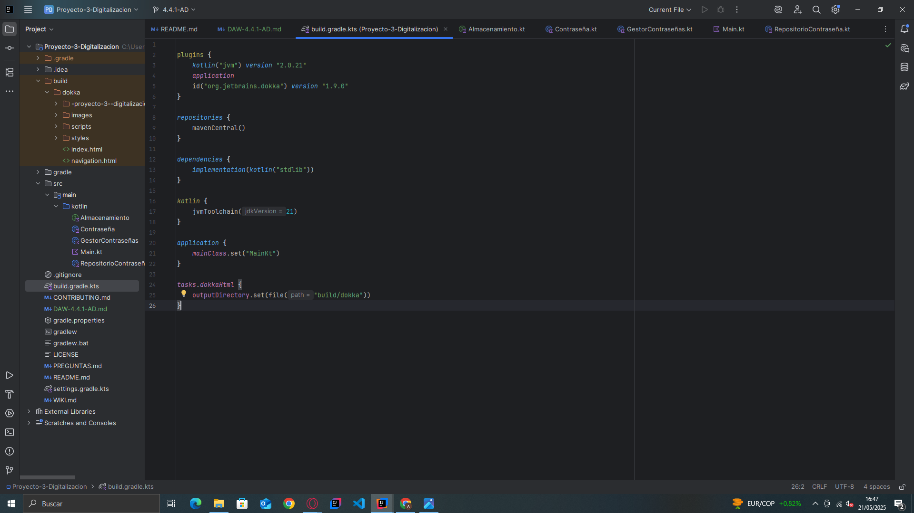
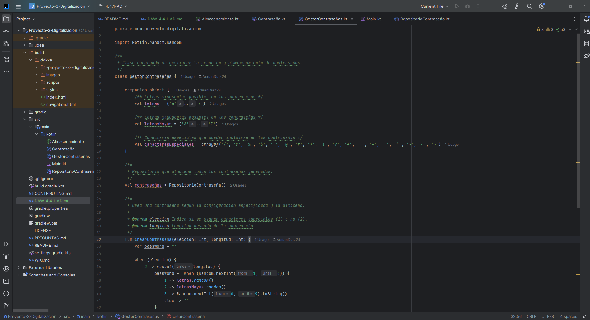
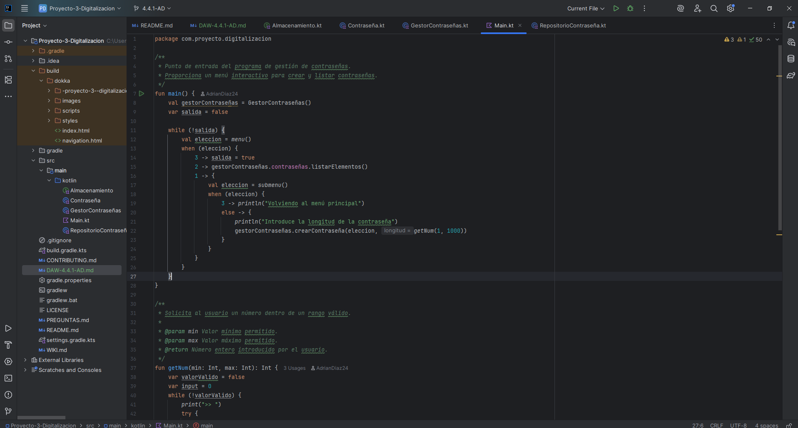
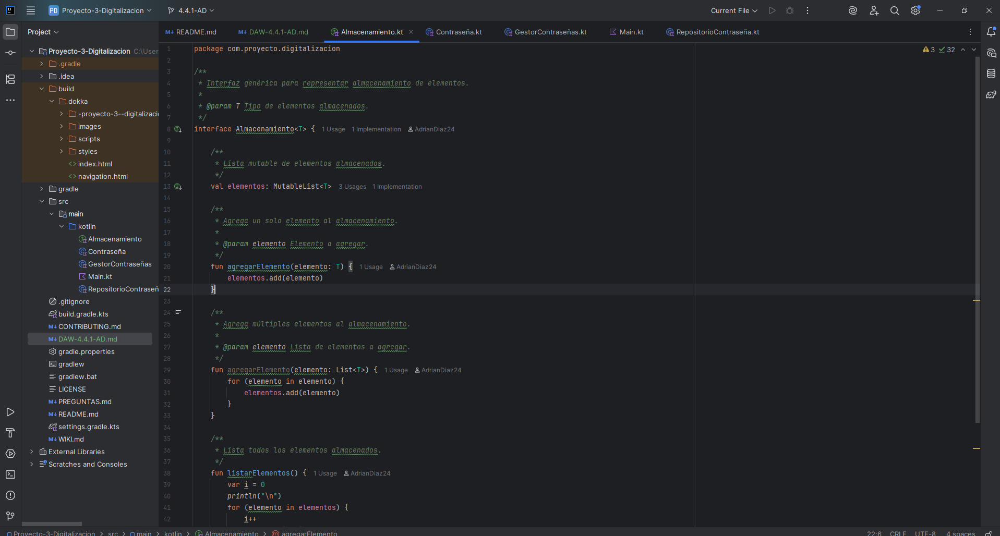
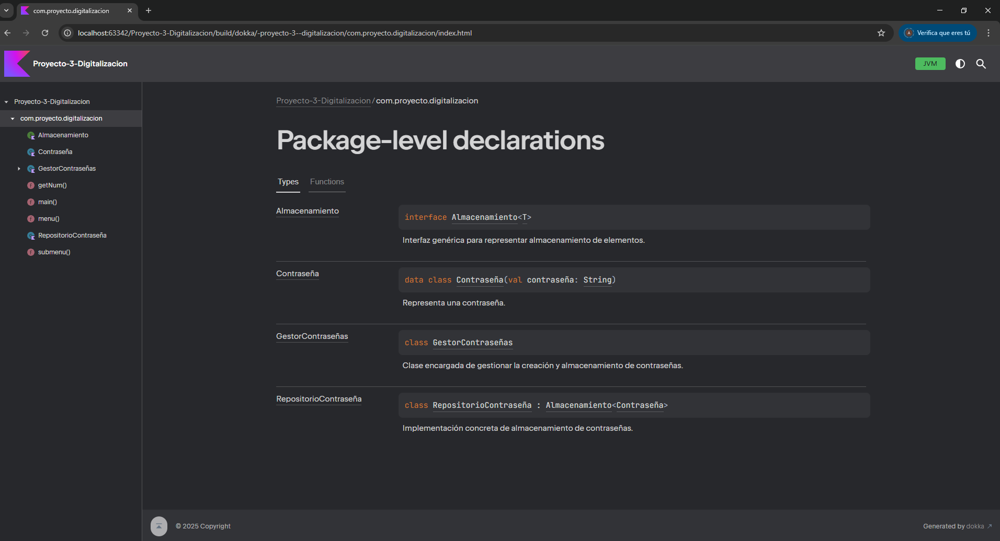
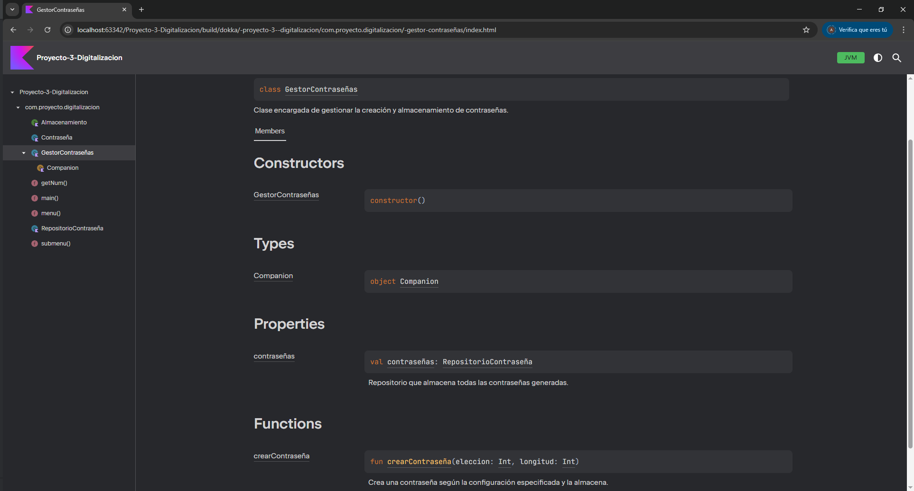
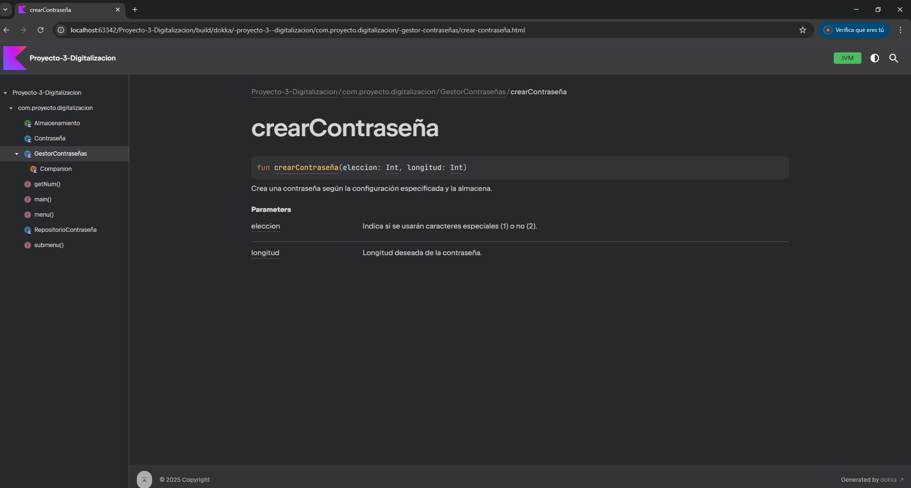

## Pasos a seguir para generar una documentacion web

Primero para pder generar la docmentacion web hay que instalaru/importar Dokka para esto tu proyecto necesita esta hecho
en Gradle y ir al archivo build.gradle.kts y en este hay que poner en la parte de plugins lo siguiente: 

```kts
id("org.jetbrains.dokka") version "1.9.0"
```
Despues de esto hay que implementar una nueva zona que sera la siguiente

``` kts 
tasks.dokkaHtml.configure {
    outputDirectory.set(file("build/dokka"))
}
```
Siendo lo de "build/dokka" la carpeta donde se creara la documentacion web, para ver el ejemplo completo de como esta implementado este proyecto puedes ver la imagen de abajo



Una vez implementado esto y sincronizado dandole al emoticono de una especie de caracol en la parte superior derecha hay  que documentar en codigo con Kdoc
para documentarlo se hace de la siguiente forma: 

``` kotlin
/**
* Resumen del uso del metodo o lo que hace
*
* @param nombre explicacion de lo que almacena el parametro
* @return explicacion de lo que devuelve la aw
+ @exception nombre explicacion de porque salta esa excepcion
*/
```
Una vez explicado como se documenta con Kdoc voy a poner abajo 3 fotos de parte ded 3 clases diferentes documentadas

1.  Clase GestorContraseñas.kt



2. Main.kt



3. Interfaz Almacenamiento.kt



Ya para finalizar solo hay que ir a la consola y escribir el siguiente comando "./gradlew dokkaHtml", esto tras unos segundos/minutos te terminara generando unas carpetas y archivos html, css, js, json y svg en la carpeta raiz que se especifico en el bulid.gradle.kts, en este caso en la carpeta build/dokka, ya para visualizar la pagina solo tienes que abrir el archivo index.html.

1. Pagina principal: en la pagina principal (index.html) aparacen todas las clases del programa con su dedscripcion



2. Pagina del GestorContraseña.kt: En esta pagina se ve todas las funciones y parametros de la clase



3. Pagina de la funcion crearContraseña(): En esta pagina te muestra los parametros que hay que introducirle a la funcion, tanto para que se usan y un resumen del funcionamiento del metodo



## Ruta para entrar en la documentacion web

- Ruta relativa al archivo: build/dokka/index.html
- URL: https://adriandiaz24.github.io/Proyecto-3-Digitalizacion/